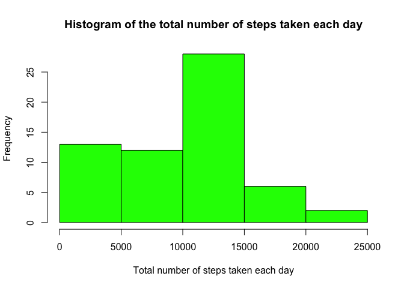
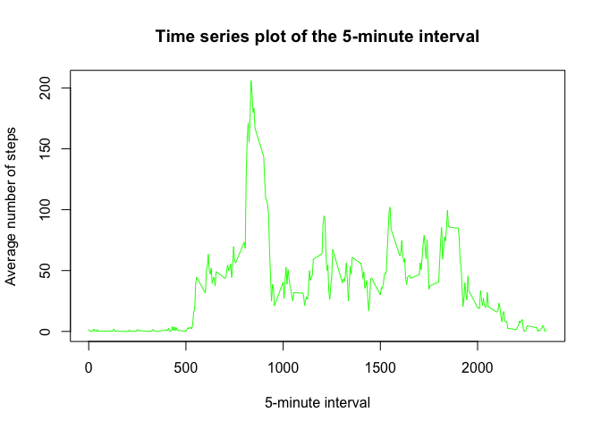
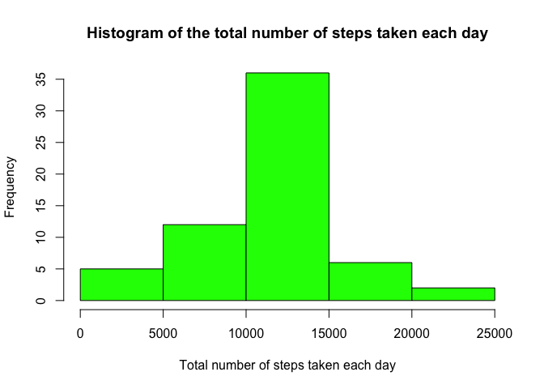
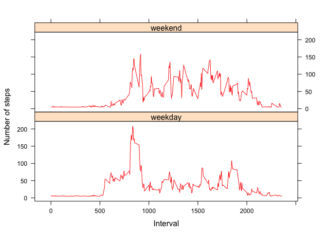

# Reproducible Research: Peer Assessment 1

## Loading needed library

```r
library(dplyr)
library(lattice)
```

## Loading and preprocessing the data
####1. Load the data to r object

```r
activity_data <- read.csv(file="activity.csv")
```
####2. Process/transform the data: we don't need process currant data.

## What is mean total number of steps taken per day?
####1. Calculate the total number of steps taken per day

```r
total_steps_data <- activity_data %>%
    select(date, steps) %>%
    group_by(date) %>%
        summarise_each(funs(sum(., na.rm=TRUE)))
names(total_steps_data) <- c("date", "total_steps")
```
####2. Make a histogram of the total number of steps taken each day

```r
with(total_steps_data,
    hist(x=total_steps, col = "green",
        xlab = "Total number of steps taken each day",
        main = "Histogram of the total number of steps taken each day"))
```

<!-- -->

####3. Calculate and report the mean and median of the total number of steps taken per day

```r
with(total_steps_data, c(mean = mean(total_steps, na.rm = TRUE), median = median(total_steps, na.rm = TRUE)))
```

```
##     mean   median 
##  9354.23 10395.00
```


## What is the average daily activity pattern?
####1. Make a time series plot (i.e. 𝚝𝚢𝚙𝚎 = "𝚕") of the 5-minute interval (x-axis) and the average number of steps taken, averaged across all days (y-axis)
##### Calculate the average number of steps taken per each 5-minutes interval

```r
average_activity_data <- activity_data %>%
    select(interval, steps) %>%
        group_by(interval) %>%
            summarise_each(funs(mean(., na.rm=TRUE)))
names(average_activity_data) <- c("interval", "steps_average")
```
##### Make a time series plot of the 5-minute interval

```r
with(average_activity_data,
    plot(x = interval,
         y = steps_average,
         type = "l",
         xlab = "5-minute interval",
         ylab = "Average number of steps",
         main = "Time series plot of the 5-minute interval",
         col = "green"))
```

<!-- -->
####2. Which 5-minute interval, on average across all the days in the dataset, contains the maximum number of steps?

```r
average_activity_data %>%
    filter(steps_average == max(steps_average))
```

```
## # A tibble: 1 × 2
##   interval steps_average
##      <int>         <dbl>
## 1      835      206.1698
```

## Imputing missing values
####1. Calculate and report the total number of missing values in the dataset (i.e. the total number of rows with 𝙽𝙰s)

```r
nrow(activity_data[is.na(activity_data$steps),])
```

```
## [1] 2304
```

####2. Fill in all of the missing values in the dataset by using the mean for that 5-minute interval.

```r
mean_steps_average <- round(mean(average_activity_data$steps_average, na.rm = TRUE))
activity_data[is.na(activity_data)] <- mean_steps_average
```

####3. Create a new dataset that is equal to the original dataset but with the missing data filled in.

```r
total_steps_data2 <- activity_data %>%
    select(date, steps) %>%
        group_by(date) %>%
            summarise_each(funs(sum(., na.rm=TRUE)))
names(total_steps_data2) <- c("date", "total_steps")
```

####4. Make a histogram of the total number of steps taken each day 

```r
with(total_steps_data2,
     hist(x=total_steps,
         col = "green",
         xlab = "Total number of steps taken each day",
         main = "Histogram of the total number of steps taken each day"))
```

<!-- -->

####5. Calculate and report the mean and median total number of steps taken per day.

```r
with(total_steps_data2, c(mean = mean(total_steps, na.rm = TRUE), median = median(total_steps, na.rm = TRUE)))
```

```
##     mean   median 
## 10751.74 10656.00
```

## Are there differences in activity patterns between weekdays and weekends?
####1. Create a new factor variable in the dataset with two levels – “weekday” and “weekend” indicating whether a given date is a weekday or weekend day.

```r
activity_data2 <- mutate(activity_data, 
                        day_type = as.factor(sapply(activity_data$date,
                                    FUN = function(date) {
                                            day <- weekdays(as.Date(date))
                                            if (day == "Saturday" || day == "Sunday") {
                                                "weekend"
                                            } else {
                                                "weekday"
                                            }
                                    })))
```
####2. Calculate the average number of steps taken, averaged across all weekday days or weekend days

```r
average_activity_data2 <- activity_data2 %>%
    select(interval, steps, day_type) %>%
        group_by_(.dots= c("day_type", "interval")) %>%
            summarise_each(funs(mean(., na.rm=TRUE)))
```
####3. Make a panel plot containing a time series plot (i.e. 𝚝𝚢𝚙𝚎 = "𝚕") of the 5-minute interval (x-axis) and the average number of steps taken, averaged across all weekday days or weekend days (y-axis). See the README file in the GitHub repository to see an example of what this plot should look like using simulated data.

```r
xyplot(steps ~ interval | day_type,
       average_activity_data2, type = "l",
       layout = c(1, 2), 
       xlab = "Interval",
       ylab = "Number of steps",
       col = "red")
```

<!-- -->

